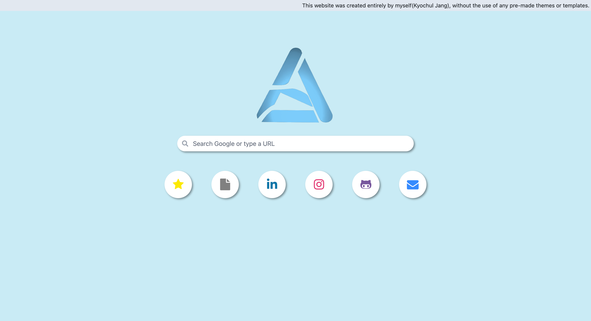

# Kyochul Jang's Portfolio Website

  <div align='center'>
        
        
        
        
        <br />
        
        
        
        
    </div>
<br />

Welcome to the repository for my personal portfolio website, [kyochuljang.com](https://kyochuljang.com/). This website showcases my work, skills, and projects as a professional in the field. Amazing this is that this website was built from the scratch without the use of any prebuilt themes ot templates. Feel free to explore the site and this repository to get a better understanding of my capabilities and experiences.

  <div align='center'>



</div>

## Overview

This website is designed to present a comprehensive look at my professional journey, highlighting projects I've been involved with, technologies I've mastered, and my continuous learning path. Whether you're a potential employer, a fellow professional, or just curious, you'll find detailed insights into the work that I do.

## Technologies Used

This site is built using a variety of modern web technologies, including:

- **HTML5**
- **CSS3**
- **Tailwind**
- **JavaScript**
- **Node.js**
- **React**
- **Firebase**
- **Netlify**

## Setup
You can either access to [kyochuljang.com](https://kyochuljang.com/)

or

clone and run this application locally by following these steps:

1. Clone the repository:
```bash
git clone https://github.com/OfficerChul/kyochuldotcom.git
```
2. Navigate to the project directory:
```bash
cd kyochuljangdotcom
```
3. Install dependencies:
```bash
pnpm install
```
4. Run the development server
```bash
pnpm run dev
```

## Interested in contributing to my portfolio website project? Great to hear that! Here is how you can contribute:
1.	Fork the repository.
2.	Create your feature branch (git checkout -b feature/AmazingFeature).
3.	Commit your changes (git commit -m 'Add some AmazingFeature').
4.	Push to the branch (git push origin feature/AmazingFeature).
5.	Open a pull request.

## License
```
MIT License

Copyright (c) 2024 OfficerChul

Permission is hereby granted, free of charge, to any person obtaining a copy
of this software and associated documentation files (the "Software"), to deal
in the Software without restriction, including without limitation the rights
to use, copy, modify, merge, publish, distribute, sublicense, and/or sell
copies of the Software, and to permit persons to whom the Software is
furnished to do so, subject to the following conditions:

The above copyright notice and this permission notice shall be included in all
copies or substantial portions of the Software.

THE SOFTWARE IS PROVIDED "AS IS", WITHOUT WARRANTY OF ANY KIND, EXPRESS OR
IMPLIED, INCLUDING BUT NOT LIMITED TO THE WARRANTIES OF MERCHANTABILITY,
FITNESS FOR A PARTICULAR PURPOSE AND NONINFRINGEMENT. IN NO EVENT SHALL THE
AUTHORS OR COPYRIGHT HOLDERS BE LIABLE FOR ANY CLAIM, DAMAGES OR OTHER
LIABILITY, WHETHER IN AN ACTION OF CONTRACT, TORT OR OTHERWISE, ARISING FROM,
OUT OF OR IN CONNECTION WITH THE SOFTWARE OR THE USE OR OTHER DEALINGS IN THE
SOFTWARE.
```
